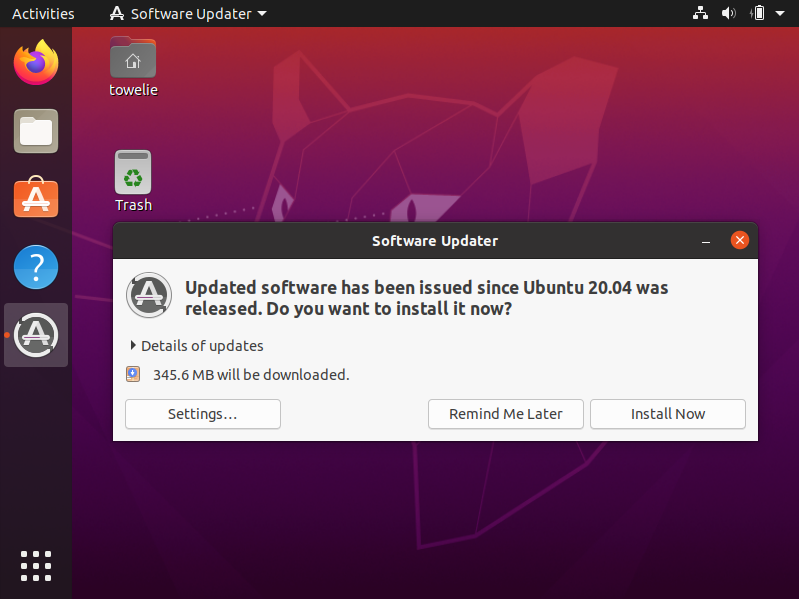
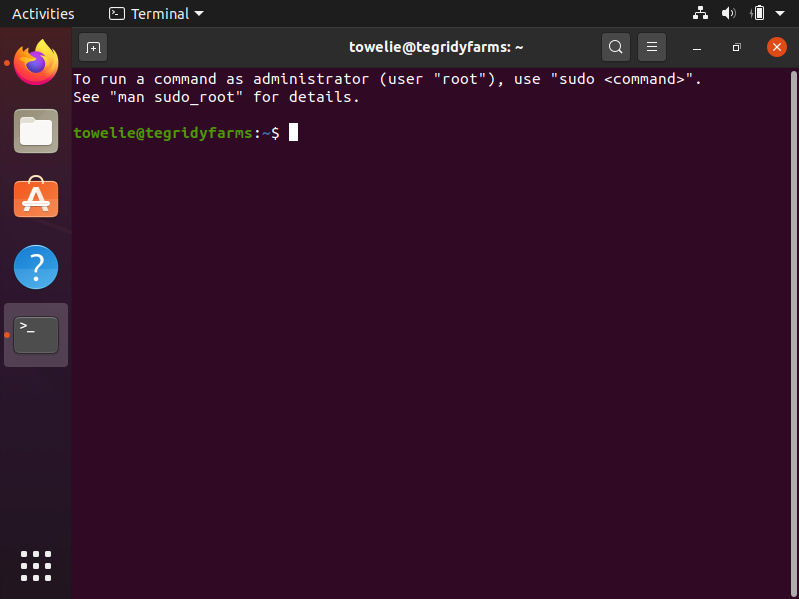

# Ubuntu 20.04.1 LTS (Focal Fossa)

## Prepare installation media

- Download ISO file [ubuntu-20.04.1-desktop-amd64.iso](https://releases.ubuntu.com/20.04.1/ubuntu-20.04.1-desktop-amd64.iso) for Ubuntu. (Or alternatively [lubuntu-20.04.1-desktop-amd64.iso](https://cdimage.ubuntu.com/lubuntu/releases/20.04.1/release/lubuntu-20.04.1-desktop-amd64.iso) for Lubuntu.)

- Use `dd` to extract ISO file to USB flash drive. (Use `lsblk` to find out which device `/dev/sda`, `/dev/sdb` or `/dev/sdc` and so on belongs to the USB flash drive and then replace `/dev/null` with it. Also, replace `ubuntu-20.04.1-desktop-amd64.iso` with `lubuntu-20.04.1-desktop-amd64.iso` if you're installing Lubuntu.)

    ```
    dd bs=4M if=ubuntu-20.04.1-desktop-amd64.iso of=/dev/null conv=fdatasync status=progress
    ```

    **Warning:** All data on the `of=` target will be lost. Double-check that you selected the USB flash drive and not your system drive or any other device.

## Main installation

- Boot from USB flash drive to start the installation. The installation files will be checked for any errors.

    

- After error checking you will be greeted with the following welcome screen. Select "English" and "Install Ubuntu".

    

- Select the correct keyboard layout by clicking on "Detect Keyboard Layout".

    

- Select "Minimal installation". Make sure that "Download updates" is not checked and "Install third-party software" is checked.

    

- Make sure that installation type "Erase disk" is selected, then click on "Advanced features".

    

- Select "Use LVM" and make sure that "Encrypt" is checked. Confirm with "OK". Then click on "Install Now".

    

- Choose a security key for the disk encryption. You will need to type in this password every time you turn on the computer. (See [https://xkcd.com/936/](https://xkcd.com/936/) for guidance on how to choose a good passphrase.) Make sure that "Overwrite empty disk space" is selected. (If you're absolutely sure that the drive is already encrypted, you don't have to check that option. But it can't hurt to do so.)

    

- Confirm writing the changes to disks.

    

- Select timezone and locale. Just choose "New York" for now. This setting can easily be adjusted later.

    

- Provide user information. This password is the password that you will have to type in for `sudo` commands. Also, it doesn't have to be as secure as the encryption security key. Finally, feel free to select "Log in automatically" because there is already the security check from disk encryption.

    

- Installation is now in progress.

    

- Wait until installation is complete and click "Restart Now".

    

- Remove the USB flash drive and press <kbd>↵ Enter</kbd>.

    

- Unlock disk encryption.

    

- Ignore "Connect Your Online Accounts" and click on "Skip".

    

- Ignore "Livepatch" and click on "Next".

    

- Select "No, don't send system info" and click on "Next".

    

- Click on "Next".

    

- Basic system installation is finished. Click on "Done".

    

- Open the settings on the top right to connect to a WiFi network if there is no internet connection yet.

    

- If the "Software Updater" shows up at any point, click on "Remind Me Later".

    

- Open Firefox, browse to this page and copy (all lines at once) the following command into the clipboard.

    ```
    clear && sudo -- sh -c 'xset s noblank ; xset s off ; xset -dpms ; export DEBIAN_FRONTEND=noninteractive
    for package in lubuntu-update-notifier muon noblenote plasma-discover qtpass quassel transmission-qt trojita update-notifier ; do apt -y remove "$package" ; done ; snap remove snap-store
    dpkg --add-architecture i386 ; apt update ; apt -y autoremove ; apt -y clean ; apt -y upgrade
    apt -y install build-essential curl deluge ffmpeg filezilla firefox gimp git imagemagick libreoffice lm-sensors ncdu p7zip-full python python3 python3-pip python3-tk texlive-full texstudio tor torsocks vim virtualbox vlc winbind wine wine32 winetricks
    apt -y install 0ad 2048-qt aisleriot assaultcube extremetuxracer gcompris gnome-games hedgewars minetest pokerth steam supertux supertuxkart
    for url in https://dl.google.com/linux/direct/google-chrome-stable_current_amd64.deb https://download3.operacdn.com/pub/opera/desktop/74.0.3911.75/linux/opera-stable_74.0.3911.75_amd64.deb https://go.skype.com/skypeforlinux-64.deb "https://code.visualstudio.com/sha/download?build=stable&os=linux-deb-x64" https://launchpad.net/veracrypt/trunk/1.24-update7/+download/veracrypt-1.24-Update7-Ubuntu-20.04-amd64.deb ; do filename="$(mktemp).deb" ; wget -O "$filename" "$url" ; dpkg -i "$filename" ; rm "$filename" ; done
    add-apt-repository -y ppa:lutris-team/lutris ; apt update ; apt -y install lutris
    clear ; echo Reboot now to finish the installation.'
    #
    ```

- Open a terminal window with <kbd>Ctrl</kbd> + <kbd>Alt</kbd> + <kbd>t</kbd>.

    

- Paste the command with <kbd>Ctrl</kbd> + <kbd>Shift</kbd> + <kbd>v</kbd>. Press <kbd>↵ Enter</kbd> to run the command if necessary. It worked if you're being asking to type in your user password.

    

- Reboot now.

    

## Additional steps

- Sign in to Firefox, Chrome and/or Opera for synchronisation of bookmarks, logins etc.

- Other settings...?
